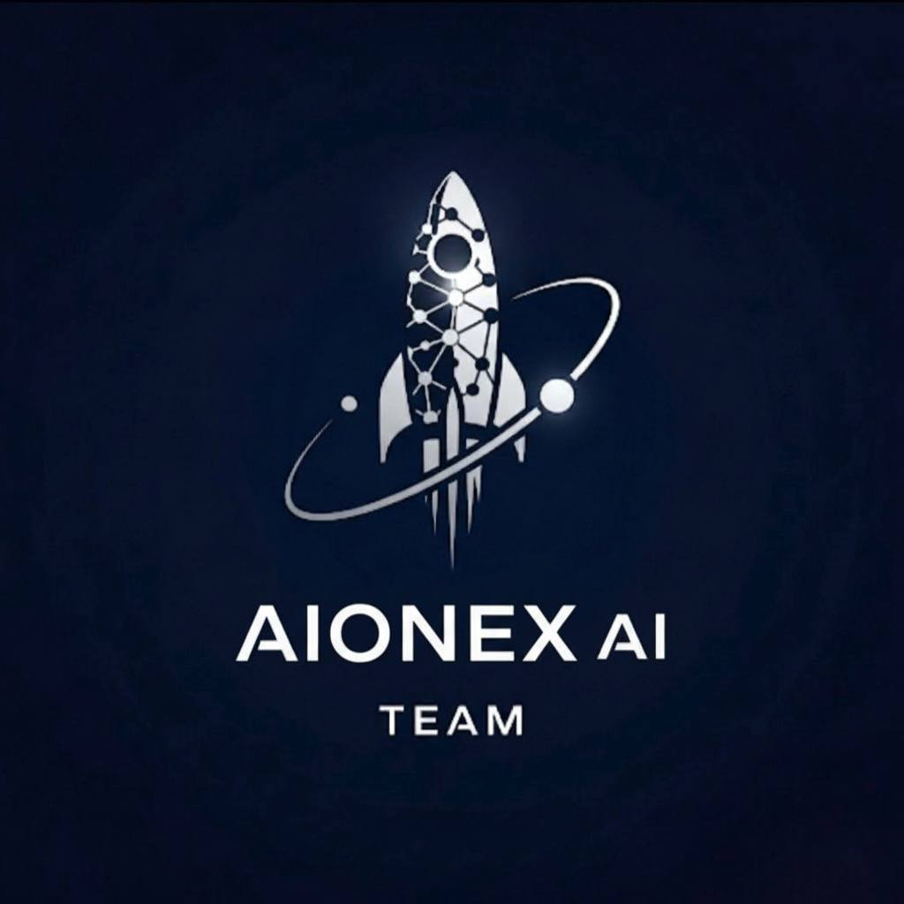

سلام. مشکل فایل `README.md` شما بسیار ساده است: شما قبل از تمام تگ‌های HTML (مانند `<p>`، ``، `<em>` و `<a>`) از یک کاراکتر بک‌اسلش (`\`) استفاده کرده‌اید.

این کاراکتر (`\`) در Markdown یک "کاراکتر گریز" (Escape Character) است. این کاراکتر به پردازشگر Markdown می‌گوید که کاراکتر بعدی (در اینجا، علامت `<`) را به عنوان یک دستور HTML تفسیر *نکند*، بلکه آن را به عنوان یک متن ساده نمایش دهد.

به همین دلیل است که شما به جای دیدن تصویر و پاراگراف‌های وسط‌چین، خودِ کد `<p align="center">` را می‌بینید.

### 🩹 راه‌حل (نسخه اصلاح‌شده)

شما خواستید که چیزی را تغییر ندهم، اما برای اینکه HTML به درستی نمایش داده شود، **باید** این بک‌اسلش‌های اضافه حذف شوند.

من هیچ تغییری در **محتوای** متن شما (توضیحات پروژه، ویژگی‌ها و ...) نداده‌ام و فقط این خطاهای نوشتاری (بک‌اسلش‌های اضافی) را اصلاح کرده‌ام تا فایل شما به درستی در پلتفرم‌هایی مانند GitHub رندر شود.

کافی است متن زیر را کپی کرده و به طور کامل جایگزین محتوای فایل `README.md` خود کنید:

````markdown
# 🎨 PsyDesign AI — AI-Powered Brand Identity Generator

<p align="center">

</p>

<p align="center">
<em>
An intelligent design partner that translates a simple idea into a complete, psychology-driven brand identity. PsyDesign AI combines the power of brand strategy with generative AI to craft everything from a brand's core personality to its visual identity in seconds.
</em>
</p>

<p align="center">
<a href="#-key-features">Features</a> •
<a href="#-technology-stack">Technology Stack</a> •
<a href="#-architecture--data-flow">Architecture</a> •
<a href="#-demo-version-notice">Demo Notice</a> •
<a href="#-project-setup-guide">Setup Guide</a> •
<a href="#-license">License</a>
</p>

-----

<p align="center">
From a single sentence, PsyDesign AI generates a comprehensive brand report, a unique logo with DALL-E 3, and an interactive brand persona powered by GPT-4o. This project demonstrates an end-to-end solution for automated brand creation, built on a high-performance FastAPI backend and a dynamic, responsive frontend.
</p>

-----

## 🚀 Key Features

PsyDesign AI provides a complete, automated branding pipeline with the following features:

### 🧠 AI-Powered Brand Strategy Report

The platform leverages **GPT-4o** to generate a comprehensive **Brand Psychology Report** from a single user prompt. This report includes:

  * **Brand Personality:** Defines the brand's archetype (e.g., The Hero, The Sage), tone of voice, and core values.
  * **Visual Identity:** Suggests a live font pairing from Google Fonts, ready for web use.
  * **Creative Assets:** Proposes multiple unique brand names and memorable slogans.
  * **Narrative:** Crafts a compelling brand story and a ready-to-use social media bio.
  * **Targeting:** Creates a detailed target audience persona with interests, demographics, and pain points.
  * **Marketing Idea:** An initial, creative marketing campaign concept to kickstart strategy.

-----

### ✨ Instant Logo Generation with DALL-E 3

  * **Contextual Visuals:** The system uses the `logo_concept_description` from the GPT-4o report to generate a highly relevant and detailed prompt for **DALL-E 3**.
  * **High-Quality Output:** Generates HD quality (1024x1024) logos that are minimalist, iconic, and versatile.
  * **Integrated Download:** Users can download the generated logo directly from the UI, facilitated by a secure image proxy endpoint.

-----

### 💬 Interactive Brand Persona

  * **Chat with Your Brand:** After generation, users can interact with a GPT-4o powered AI persona that fully embodies the new brand's tone and personality.
  * **Context-Aware & Safe:** The persona is instructed to only answer questions related to the generated brand identity and politely decline any off-topic queries.
  * **Text-to-Speech:** Users can listen to the brand persona's responses, powered by OpenAI's **TTS-1-HD** model for high-fidelity audio.

-----

### 🌐 Robust & Scalable Platform

  * **Multi-Language Support:** The entire interface and all AI-generated content can be produced in **English, Spanish, French, Arabic, Chinese, and Hindi**.
  * **Persistent History:** All generated brand identities, including their reports and logos, are saved to a database via **SQLAlchemy ORM** and can be revisited, compared, or deleted.
  * **Modern & Responsive UI:** A clean, intuitive interface built with a mobile-first approach ensures a seamless experience on any device.

-----

## 🛠 Technology Stack

This project is built with a modern, high-performance Python stack, emphasizing scalability, type safety, and best practices in API development.

| Area      | Technology          | Purpose                                                       _                      |
| :-------- | :------------------ | :------------------------------------------------------------------------------- |
| **Backend** | 🐍 **Python 3.10+** | Core application logic and asynchronous request handling.                        |
|           | 🚀 **FastAPI** | A high-performance web framework for building robust, type-safe APIs with automatic OpenAPI documentation.   |
|           | 🐘 **SQLAlchemy** | Provides a powerful Object-Relational Mapper (ORM) for elegant database interactions.      |
|           | 🅿️ **Pydantic** | Enforces strict data validation for all API requests and responses.           _              |
|           | 🌀 **Uvicorn** | A lightning-fast ASGI server for running the FastAPI application.                    |
| **AI Services** | 🧠 **OpenAI GPT-4o** | The core model for generating the Brand Psychology Report and powering the chat persona. |
|           | 🎨 **OpenAI DALL-E 3** | The model used for generating high-quality, context-aware logos.                |
|           | 🗣️ **OpenAI TTS-1-HD** | Generates high-fidelity, natural-sounding audio for the persona's responses.      |
| **Frontend**| ✨ **JavaScript (ES6+)** | Handles all client-side logic, dynamic rendering, and asynchronous API communication.   |
|           | 🎨 **HTML5 & CSS3** | Structures the application and provides a modern, responsive, and animated design. |
| **Database**| 🗄 **SQLite** | A self-contained, serverless database for storing brand generation history. Easily swappable for PostgreSQL in production. |

-----

## ⚙️ Architecture & Data Flow

The application follows a clean, decoupled architecture:

1.   **User Input:** A user submits a brand description via the frontend.
2.   **API Request & Validation:** The request hits a FastAPI endpoint. **Pydantic** automatically validates the incoming data for correctness.
3.   **GPT-4o Analysis:** The backend constructs a detailed, structured JSON prompt and sends it to the **GPT-4o** API. This generates the core Brand Psychology Report.
4.   **DALL-E 3 Logo Generation:** The `logo_concept_description` from the GPT-4o response is used to create a new, highly specific prompt for the **DALL-E 3** API, which returns a unique logo URL.
5.   **Database Persistence:** The complete brand report (JSON) and the logo URL are saved to the SQLite database as a new history item using **SQLAlchemy**.
6.   **Response to Client:** The backend sends the complete brand data (report and logo URL) back to the frontend.
7.   **Dynamic Rendering:** The frontend JavaScript parses the JSON and dynamically builds the entire results page, including the report, logo, font previews, and the interactive chat window.

-----

## ⚠️ Demo Version Notice

This repository represents a **demo version** of PsyDesign AI.

  * All OpenAI API calls are replaced with **mock data** for demonstration purposes.
  * The production API key and some internal optimization scripts are intentionally removed for security.
  * Full source code and proprietary models are available under a separate **purchase agreement**.

For inquiries regarding the full version or IP transfer, please contact:
📧 **[artinghorbanianainex@gmail.com](mailto:artinghorbanianainex@gmail.com)**

-----

## 🏁 Project Setup Guide

Follow these steps to run the full project locally.

### 1\. Prerequisites

  * **Python 3.10** or newer
  * **Git**
  * An **OpenAI API Key** (if you wish to enable live API calls).

### 2\. Clone the Repository

```bash
git clone [https://github.com/YourUsername/PsyDesign-AI.git](https://github.com/YourUsername/PsyDesign-AI.git)
cd PsyDesign-AI
````

### 3\. (Recommended) Create a Virtual Environment

```bash
# On macOS / Linux
python3 -m venv venv
source venv/bin/activate

# On Windows
python -m venv venv
.\venv\Scripts\activate
```

### 4\. Install Dependencies

Create a file named `requirements.txt` in the project root with the following content:

```txt
fastapi
uvicorn[standard]
sqlalchemy
openai
httpx
jinja2
```

Then, run the installation command:

```bash
pip install -r requirements.txt
```

### 5\. Configure API Key

  * This demo version **does not contain an API key** for security reasons. The app will run using local mock data.
  * All API endpoints in `app.py` are ready and can be activated by adding your own OpenAI API key.

To enable live generation, open the `app.py` file and replace the placeholder (around **line 20**) with your OpenAI API key:

```python
# In app.py
API_KEY = "YOUR_OPENAI_API_KEY" 
```

> **Security Note:** For production, it is strongly recommended to load the API key from an environment variable or a secrets management service instead of hardcoding it.

### 6\. Run the Application

```bash
uvicorn app:app --reload
```

The server will start, and you can access the application.

### 7\. Open the App

Navigate to **[http://127.0.0.1:8000](https://www.google.com/search?q=http://127.0.0.1:8000)** in your web browser to launch PsyDesign AI\! 🚀

-----

## ©️ License

**Copyright (c) 2025 Artin Ghorbanian**
**All Rights Reserved.**

This project and its source code are proprietary and confidential. Unauthorized copying, distribution, or use of this software, via any medium, is strictly prohibited.
